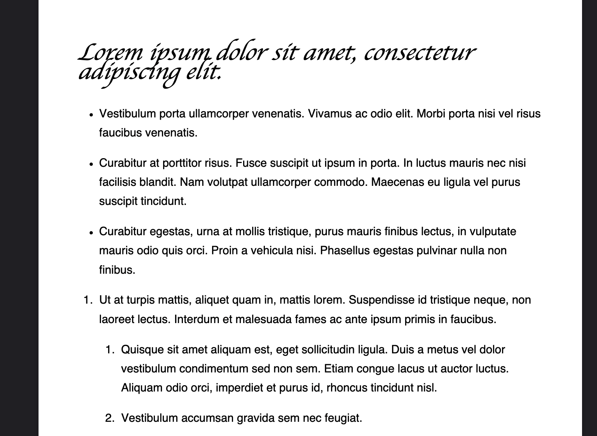
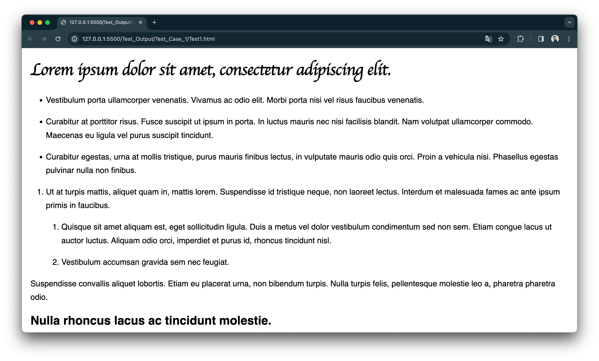
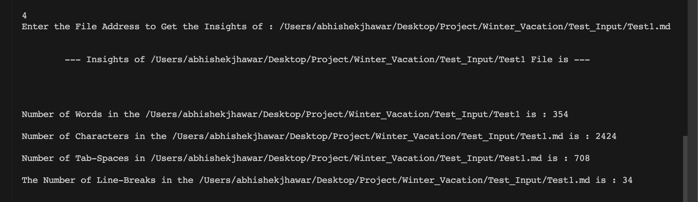

# Introduction

This innovative tool was born out of a need for a more reliable and efficient way to convert Markdown files into PDF and HTML formats.

As a developer, I frequently encountered challenges with existing VSCode extensions for Markdown conversion. The primary issue was that these extensions often failed to convert Markdown files into PDFs with selectable text and proper styling tags. This limitation not only hindered readability but also affected the overall presentation of the documents.

Determined to find a solution, I embarked on creating a custom Markdown converter. This project aims to address the shortcomings of existing tools by ensuring high-quality conversions that maintain text selectability and styling fidelity in the output files. Our converter is not just a tool; it's a response to a real-world problem, offering a practical and user-friendly solution for developers and content creators alike.

---
<br>

# Technologies Involoved : 

<div style="display:flex;justify-content:space-evenly;">
<div style="width:65px;">


</div>
<div style="width:65px;">


</div>
<div style="width:50px;">


</div>
</div>

---

<br>


# Functions and their Alogirthms

Below is an overview of these functions along with their pseudo-codes to provide a clear understanding of their inner workings.

### 1. `mdToHtml(mdFile)`
   - **Purpose**: Converts a Markdown file to HTML.
   - **Algorithm**:
     ```
     Read Markdown file
     Convert Markdown content to HTML using markdown_it
     Append CSS styling
     Write the HTML content to a new file with .html extension
     ```

### 2. `mdToPdf()`
   - **Purpose**: Converts a Markdown file to PDF.
   - **Algorithm**:
     ```
     Check if HTML file exists, if not, call mdToHtml()
     Configure PDF conversion settings
     Convert HTML file to PDF using pdfkit
     Handle exceptions during conversion
     ```

### 3. `pdfToMd()`
   - **Purpose**: Converts a PDF file to Markdown.
   - **Algorithm**:
     ```
     Extract text from PDF using pdfminer
     Format text into Markdown syntax
     Write formatted text to a new Markdown file
     ```

### 4. `detailsOfFile(Fileaddress)`
   - **Purpose**: Provides insights into the content of a file.
   - **Algorithm**:
     ```
     Open and read file content
     Convert to plain text if HTML
     Calculate words, characters, tab spaces, and line breaks
     Return these details
     ```

---
<br>

# Flow of the Program

1. **Start**: The program initiates with the `main` function, which presents the user with a menu of options.

2. **User Input**: The user selects an option to perform one of the following tasks: 
    - Convert Markdown to HTML (`mdToHtml`)
    - Convert Markdown to PDF (`mdToPdf`)
    - Convert PDF to Markdown (`pdfToMd`)
    - Get file details (`detailsOfFile`)

3. **Processing**: 
    - If the user chooses to convert Markdown to HTML or PDF, the program first checks if the necessary files exist and then proceeds with the conversion.
    - For PDF to Markdown conversion, the program extracts text from the PDF and formats it into Markdown syntax.
    - If the user opts to get file details, the program analyzes the specified file and returns information like word count, character count, etc.

4. **Output Generation**:
    - For conversions, the output is a new file in the chosen format (HTML, PDF, or Markdown) saved in the specified folder.
    - For file details, the output is a summary of the file’s contents displayed to the user.

5. **Loop for Continual Operation**: The program loops back to the menu, allowing users to perform additional tasks or exit the program.

---
<br>

# How to Run and Requirements

To ensure a smooth experience with our Markdown File Converter, it's important to understand the prerequisites and steps to run the program. Here's a guide:

## Requirements

Before running the program, make sure you have the following installed:

- Python 3.x: The programming language used to write the converter.

- Libraries: `markdown_it`, `pdfkit`, `html2text`, `pdfminer`, and `dotenv`. These can be installed via pip:

  ```
  pip install markdown_it pdfkit html2text pdfminer dotenv
  ```

- wkhtmltopdf: This is required for converting HTML to PDF. Download and install it from [wkhtmltopdf.org](https://wkhtmltopdf.org/).


## Running the Program

Follow these steps to run the Markdown File Converter:

1. **Clone the Repository**: Clone this repository to your local machine.

2. **Environment Variables**: Set up environment variables for your folder path and filename in a `.env` file.

3. **Launch**: Run the program by executing the main Python script:

   ```
   python3 main.py
   ```

4. **Use the Menu**: Interact with the menu in the 
console to choose the desired conversion or file analysis operation.

5. **Check Output**: The converted files or file details will be available in the specified folder or displayed in the console.

---

<br>

# Structure and Composition of the Program

Understanding the architecture and organization of the Markdown File Converter is essential for developers who may want to contribute or customize the code. Here insights into the program's structure:

## Project Structure

The project is structured as follows:

```

Markdown-File-Converter/
│
├── main.py                 -> Main script to run the program
├── .env                    -> Environment variables file
├── Styles.css              -> CSS file for styling the HTML output
├── README.md               -> Documentation (you are here)
├── your_markdown_file.md   -> Input Markdown file
└── your_output_file.pdf    -> Output PDF file (generated by the program)

```

## Code Composition

- `main.py`: The entry point of the program that handles user interactions and calls relevant functions.

- `.env`: Environment variables file containing folder path and filename.

- `Styles.css`: CSS file used to style the HTML output.

- `README.md`: This documentation file.

- `your_markdown_file.md`: Input Markdown file (replace with your own).

- `your_output_file.pdf`: Output PDF file (generated by the program).

## Functions and Modules

- `mdToHtml`, `mdToPdf`, `pdfToMd`, and `detailsOfFile`: These functions perform specific tasks as described earlier.

- External libraries such as `markdown_it`, `pdfkit`, `html2text`, and `pdfminer` are utilized for Markdown processing, PDF generation, and text extraction.

- The program leverages environment variables to dynamically set input and output file paths.

---

<br>

# Test-Cases Descriptions

## **Test Case 1 :**

In this test,the Markdown to HTML conversion using `Test1.md`. This file contains headings, lists, and subheadings. The aim is to ensure accurate conversion, maintaining structure and styling.

**Steps:**

1. Input: `Test1.md` with complex Markdown.
2. Convert to HTML using the Markdown File Converter.
3. Check for proper structure, formatting, and styling.
4. Verify readability and visual coherence.

### **Outcome:**

### Pdf Preview



### HTML File Preview 



### Details of the File 



---

<br>

## **Test Case 2 :**


In this test case, it will  convert a complex Markdown file named `Test2.md` into HTML format using the Markdown File Converter. `Test2.md` contains a variety of Markdown elements, including headings, lists, sublists, and code blocks.

### Steps

1. Open the Markdown File Converter program.

2. Select the option to convert Markdown to HTML.

3. Specify the path to the `Test2.md` file when prompted.

4. Observe the program's conversion process.

### Outcome

### Pdf Preview


<br>


### HTML File Preview 

<br>


<br>


### Details of the File 

<br>


---

<br>

## **Test Case 3 :**

- `Test3.md` contains a complex Markdown document with various elements such as headings, lists, paragraphs, and more.

- To verify that the Markdown File Converter accurately converts this complex Markdown file to both HTML and PDF formats while preserving formatting and styling.Here HTML file is generated but is **`Deleted or Revoked from Resp. Directory `** because **`mdToPdf`** is directly called/invoked.

**Steps**:

1. Input the `Test3.md` file into the Markdown File Converter.

2. Choose the option to convert Markdown to HTML.

3. Observe the HTML output for correctness, ensuring that all elements (headings, lists, paragraphs) are properly rendered and styled.

4. Choose the option to convert Markdown to PDF.

5. Examine the PDF output for accuracy, checking that text selection is enabled and the styling matches the Markdown document.

### **Outcome**:


### Pdf Preview

<br>


<br>


### Details of the File 


---
